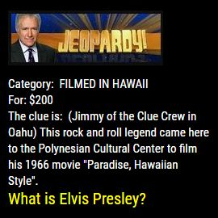

## MMM-JEOPARDY
Spanning more than 40 years, the widely popular game show comes to your Magic Mirror.
With more than *156,800* clues and answers from the show.

## How it works

Just like the show, you are presented with a category and a value for the clue in that category.
The clue is given. You have a specified amount of time to respond before the answer appears. 
Then it's on to the next category and clue. 
Fast pace. Challenging. Educational. Fun!

## Examples

* Before answer and after answer appears

, 

* Annotated .css file included for aligning and coloring text and header.
* Don't want the picture? Hate Alex Trebec? css file will easily remove it.

## Installation

* `git clone https://github.com/mykle1/MMM-JEOPARDY` into the `~/MagicMirror/modules` directory.

* No API needed!

## Config.js entry and options

    {
        module: 'MMM-JEOPARDY',
        position: 'top_left',                  // Works well anywhere
        config: { 
		    useHeader: false,              // true if you want a header
                header: "This is Jeopardy!",   // Any text you want
		    maxWidth: "250px",             // Stretch or constrain according to region
		    animationSpeed: 3000,          // New clue fades in and out
        }
    },
	

## Special thanks to SpaceCowboysDude
